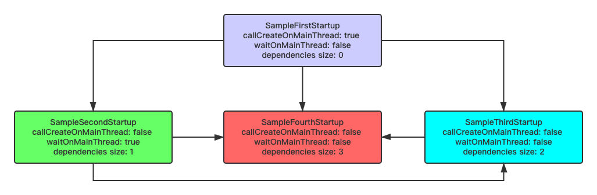

English｜[中文](README-ch.md)

# android-startup
[](https://idisfkj.github.io/archives/)
[](https://www.android.com/)
[](https://android-arsenal.com/api?level=15)
[](https://kotlinlang.org/)
[](https://github.com/idisfkj/android-startup/releases)
[]()
[](https://www.apache.org/licenses/LICENSE-2.0)

The `android-startup` library provides a straightforward, performant way to initialize components at application startup. Both library developers and app developers can use `android-startup` to streamline startup sequences and explicitly set the order of initialization.

At the same time, the `android-startup` support **async await and sync await**. And [topological ordering](https://github.com/idisfkj/android-startup/blob/master/android-startup/src/main/java/com/rousetime/android_startup/sort/TopologySort.kt) is used to ensure the initialization order of dependent components.

Here is a piece of with Google [App Startup](https://developer.android.com/topic/libraries/app-startup) feature comparison table.

|indicator|App Startup|Android Startup|
|:---:|:------:| :------:|
|Manually Config| ✅ | ✅ |
|Automatic Config| ✅ | ✅ |
|Support Dependencies| ✅ | ✅ |
|Handle Circle| ✅ | ✅ |
|Thread Of Control| ❌ | ✅ |
|Async Await| ❌ | ✅ |
|Callback Dependencies| ❌ | ✅ |
|Manual Notify| ❌ | ✅ |
|Topology Optimization| ❌ | ✅ |
|Time Cost Statistics| ❌ | ✅ |
|Thread Priority| ❌ | ✅ |
|Multiple Processes| ❌ | ✅ |

> Open source is not easy, I hope friends shake hands, a star in the upper right corner, thank you🙏

## Related Articles

[Why I abandoned the Jetpack App Startup?](https://medium.com/@idisfkj/why-i-abandoned-the-jetpack-app-startup-9963bd8865ef)

[Android Startup Analysis](https://medium.com/@idisfkj/android-startup-analysis-8ce7560f3672)

## Setup
Add the following dependency to your `build.gradle` file:

```
dependencies {
    implementation 'com.rousetime.android:android-startup:1.0.6'
}
```

> Versions update information: [Release](https://github.com/idisfkj/android-startup/releases)

## Quick Usage



There are tow ways of using android-startup in your project,need to be initialized before using android-startup.

### Define Initialize components
You define each component initializer by creating a class that implements the [AndroidStartup<T>](https://github.com/idisfkj/android-startup/blob/master/android-startup/src/main/java/com/rousetime/android_startup/AndroidStartup.kt) abstract.
This abstract implements the `Startup<T>` interface. And this abstract defines four important methods:

* The `callCreateOnMainThread(): Boolean`method,which control the `create()`method is in the main thread calls.Othrewise in the other thread.

* The `waitOnMainThread(): Boolean`method,which control the current component should call waiting in the main thread.If returns true, will block the main thread.

* The `create(): T?`method,which contains all of the necessary operations to initialize the component and returns an instance of `T`

* The `dependencies(): List<Class<out Startup<*>>>?`method,which returns a list of the other `Startup<*>` objects that the initializer depends on.

For example, Define a `SampleFirstStartup` class that implements `AndroidStartup<String>`:

```
class SampleFirstStartup : AndroidStartup<String>() {

    override fun callCreateOnMainThread(): Boolean = true

    override fun waitOnMainThread(): Boolean = false

    override fun create(context: Context): String? {
        // todo something
        return this.javaClass.simpleName
    }

    override fun dependencies(): List<Class<out Startup<*>>>? {
        return null
    }

}
```
The `dependencies()` method returns an null list because `SampleFirstStartup ` does not depend on any other libraries.

Suppose that your app also depends on a library called `SampleSecondStartup`, which in turn depends on `SampleFirstStartup`. This dependency means that you need to make sure that Android Startup initializes `SampleFirstStartup ` first.

```
class SampleSecondStartup : AndroidStartup<Boolean>() {

    override fun callCreateOnMainThread(): Boolean = false

    override fun waitOnMainThread(): Boolean = true

    override fun create(context: Context): Boolean {
        // Simulation execution time.
        Thread.sleep(5000)
        return true
    }

    override fun dependencies(): List<Class<out Startup<*>>>? {
        return listOf(SampleFirstStartup::class.java)
    }

}
```
Because you include `SampleFirstStartup` in the `dependencies()` method, Android Startup initializes `SampleFirstStartup` before `SampleSecondStartup`.

For example, you also define a [SampleThirdStartup](https://github.com/idisfkj/android-startup/blob/master/app/src/main/java/com/rousetime/sample/startup/SampleThirdStartup.kt) and a [SampleFourthStartup](https://github.com/idisfkj/android-startup/blob/master/app/src/main/java/com/rousetime/sample/startup/SampleFourthStartup.kt)

### Automatic initialization in manifest
The first one is automatic initializes startup in manifest.

Android Startup includes a special content provider called `StartupProvider` that it uses to discover and call your component startup.
In order for it to automatically identify, need in `StartupProvider` defined in the `<meta-data>` label.The `name` as defined by the component class, `value` values corresponding to the `android.startup`.

```
<provider
    android:name="com.rousetime.android_startup.provider.StartupProvider"
    android:authorities="${applicationId}.android_startup"
    android:exported="false">

    <meta-data
        android:name="com.rousetime.sample.startup.SampleFourthStartup"
        android:value="android.startup" />

</provider>
```
You don't need to add a `<meta-data>` entry for `SampleFirstStartup`, `SampleSecondStartup` and `SampleThirdStartup`, because them are a dependency of `SampleFourthStartup`. This means that if `SampleFourthStartup` is discoverable, then are also.

### Manually initialization in application
The second one is manually initializes startup in application.

Consider again the example,to make sure Android Startup can initializes,you can use `StartupManager.Builder()` directly in order to manually initialize components.

For example, the following code calls `StartupManager.Builder()` and manually initializes them:

```
class SampleApplication : Application() {

    override fun onCreate() {
        super.onCreate()
        StartupManager.Builder()
            .addStartup(SampleFirstStartup())
            .addStartup(SampleSecondStartup())
            .addStartup(SampleThirdStartup())
            .addStartup(SampleFourthStartup())
            .build(this)
            .start()
            .await()
    }
}
```
You can check out the sample [app](https://github.com/idisfkj/android-startup/tree/master/app) for more code information.

Run the example code, the console will produce the log as follows:

1. After the initialization sequence sorting optimization

```
*****/com.rousetime.sample D/StartupTrack: TopologySort result:
    |================================================================
    |         order          |    [1]
    |----------------------------------------------------------------
    |        Startup         |    SampleFirstStartup
    |----------------------------------------------------------------
    |   Dependencies size    |    0
    |----------------------------------------------------------------
    | callCreateOnMainThread |    true
    |----------------------------------------------------------------
    |    waitOnMainThread    |    false
    |================================================================
    |         order          |    [2]
    |----------------------------------------------------------------
    |        Startup         |    SampleSecondStartup
    |----------------------------------------------------------------
    |   Dependencies size    |    1
    |----------------------------------------------------------------
    | callCreateOnMainThread |    false
    |----------------------------------------------------------------
    |    waitOnMainThread    |    true
    |================================================================
    |         order          |    [3]
    |----------------------------------------------------------------
    |        Startup         |    SampleThirdStartup
    |----------------------------------------------------------------
    |   Dependencies size    |    2
    |----------------------------------------------------------------
    | callCreateOnMainThread |    false
    |----------------------------------------------------------------
    |    waitOnMainThread    |    false
    |================================================================
    |         order          |    [4]
    |----------------------------------------------------------------
    |        Startup         |    SampleFourthStartup
    |----------------------------------------------------------------
    |   Dependencies size    |    3
    |----------------------------------------------------------------
    | callCreateOnMainThread |    false
    |----------------------------------------------------------------
    |    waitOnMainThread    |    false
    |================================================================
```

2. Consumed components initialization times

```
*****/com.rousetime.sample D/StartupTrack: startup cost times detail:
    |=================================================================
    |      Startup Name       |   SampleFirstStartup
    | ----------------------- | --------------------------------------
    |   Call On Main Thread   |   true
    | ----------------------- | --------------------------------------
    |   Wait On Main Thread   |   false
    | ----------------------- | --------------------------------------
    |       Cost Times        |   0 ms
    |=================================================================
    |      Startup Name       |   SampleSecondStartup
    | ----------------------- | --------------------------------------
    |   Call On Main Thread   |   false
    | ----------------------- | --------------------------------------
    |   Wait On Main Thread   |   true
    | ----------------------- | --------------------------------------
    |       Cost Times        |   5001 ms
    |=================================================================
    |      Startup Name       |   SampleThirdStartup
    | ----------------------- | --------------------------------------
    |   Call On Main Thread   |   false
    | ----------------------- | --------------------------------------
    |   Wait On Main Thread   |   false
    | ----------------------- | --------------------------------------
    |       Cost Times        |   3007 ms
    |=================================================================
    |      Startup Name       |   SampleFourthStartup
    | ----------------------- | --------------------------------------
    |   Call On Main Thread   |   false
    | ----------------------- | --------------------------------------
    |   Wait On Main Thread   |   false
    | ----------------------- | --------------------------------------
    |       Cost Times        |   102 ms
    |=================================================================
    | Total Main Thread Times |   5008 ms
    |=================================================================
```


## More

### Optional Config

* [LoggerLevel](https://github.com/idisfkj/android-startup/blob/master/android-startup/src/main/java/com/rousetime/android_startup/model/LoggerLevel.kt): control Android Startup log level, include `LoggerLevel.NONE`, `LoggerLevel.ERROR` and `LoggerLevel.DEBUG`.

* [AwaitTimeout](https://github.com/idisfkj/android-startup/blob/master/android-startup/src/main/java/com/rousetime/android_startup/model/StartupConfig.kt): control Android Startup timeout of await on main thread.

* [StartupListener](https://github.com/idisfkj/android-startup/blob/master/android-startup/src/main/java/com/rousetime/android_startup/StartupListener.kt): Android Startup listener, all the component initialization completes the listener will be called.

#### config in manifest
To use these config, you must define a class than implements the `StartupProviderConfig` interface:

```
class SampleStartupProviderConfig : StartupProviderConfig {

    override fun getConfig(): StartupConfig =
        StartupConfig.Builder()
            .setLoggerLevel(LoggerLevel.DEBUG)
            .setAwaitTimeout(12000L)
            .setListener(object : StartupListener {
                override fun onCompleted(totalMainThreadCostTime: Long, costTimesModels: List<CostTimesModel>) {
                    // can to do cost time statistics.
                }
            })
            .build()
}
```
At the same time, you need add `StartupProviderConfig` to manifest file:

```
<provider
    android:name="com.rousetime.android_startup.provider.StartupProvider"
    android:authorities="${applicationId}.android_startup"
    android:exported="false">

    <meta-data
        android:name="com.rousetime.sample.startup.SampleStartupProviderConfig"
        android:value="android.startup.provider.config" />

</provider>
```
`StartupProvider` that it uses to discover and call `SampleStartupProviderConfig`.

#### config in application
To use these config,you need use `StartupManager.Builder()` in application.

```
override fun onCreate() {
    super.onCreate()

    val config = StartupConfig.Builder()
        .setLoggerLevel(LoggerLevel.DEBUG)
        .setAwaitTimeout(12000L)
        .setListener(object : StartupListener {
            override fun onCompleted(totalMainThreadCostTime: Long, costTimesModels: List<CostTimesModel>) {
                // can to do cost time statistics.
            }
        })
        .build()

    StartupManager.Builder()
        .setConfig(config)
        ...
        .build(this)
        .start()
        .await()
}
```

### [AndroidStartup](https://github.com/idisfkj/android-startup/blob/master/android-startup/src/main/java/com/rousetime/android_startup/AndroidStartup.kt)

* `createExecutor(): Executor`: If the startup not create on main thread, them the startup will run in the executor.

* `onDependenciesCompleted(startup: Startup<*>, result: Any?)`: This method is called whenever there is a dependency completion.

* `manualDispatch(): Boolean`: Returns true that manual to dispatch. but must be call `onDispatch()`, in order to notify children that dependencies startup completed.

* `onDispatch()`: Start to dispatch when `manualDispatch()` return true.

### [StartupCacheManager](https://github.com/idisfkj/android-startup/blob/master/android-startup/src/main/java/com/rousetime/android_startup/manager/StartupCacheManager.kt)

* `hadInitialized(zClass: Class<out Startup<*>>)`: Check whether the corresponding component initialization has been completed.

* `obtainInitializedResult(zClass: Class<out Startup<*>>): T?`: Obtain corresponding components of has been initialized the returned results.

* `remove(zClass: Class<out Startup<*>>)`: To get rid of the corresponding component initialization cache the results.

* `clear()`: Remove all the component initialization cache the results.

### [Annotation](https://github.com/idisfkj/android-startup/tree/master/android-startup/src/main/java/com/rousetime/android_startup/annotation)

* ThreadPriority: Set `Startup` to initialize thread priority.

* MultipleProcess: The process on which `Startup` is initialized.

## Sample

* [Sync And Sync](https://github.com/idisfkj/android-startup/blob/master/app/src/main/java/com/rousetime/sample/SampleCommonActivity.kt): Synchronization and synchronization depend on the scene.

* [Sync And Async](https://github.com/idisfkj/android-startup/blob/master/app/src/main/java/com/rousetime/sample/SampleCommonActivity.kt): Synchronous and asynchronous depend on the scene.

* [Async And Sync](https://github.com/idisfkj/android-startup/blob/master/app/src/main/java/com/rousetime/sample/SampleCommonActivity.kt): Asynchronous and synchronous depend on the scene.

* [Async And Async](https://github.com/idisfkj/android-startup/blob/master/app/src/main/java/com/rousetime/sample/SampleCommonActivity.kt): Asynchronous and asynchronous depend on the scene.

* [Async And Async Await Main Thread](https://github.com/idisfkj/android-startup/blob/master/app/src/main/java/com/rousetime/sample/SampleCommonActivity.kt): Asynchronous with asynchronous rely on wait in the main thread.

* [Manual Dispatch](https://github.com/idisfkj/android-startup/blob/master/app/src/main/java/com/rousetime/sample/SampleCommonActivity.kt): Manually inform rely on the complete scene.

* [Thread Priority](https://github.com/idisfkj/android-startup/blob/master/app/src/main/java/com/rousetime/sample/SampleCommonActivity.kt): Scenarios for changing thread priorities.

* [Multiple Processes](https://github.com/idisfkj/android-startup/blob/master/app/src/main/java/com/rousetime/sample/SampleCommonActivity.kt): Multi-process initialization scenarios.

## License
Please see [LICENSE](https://github.com/idisfkj/android-startup/blob/master/LICENSE)
